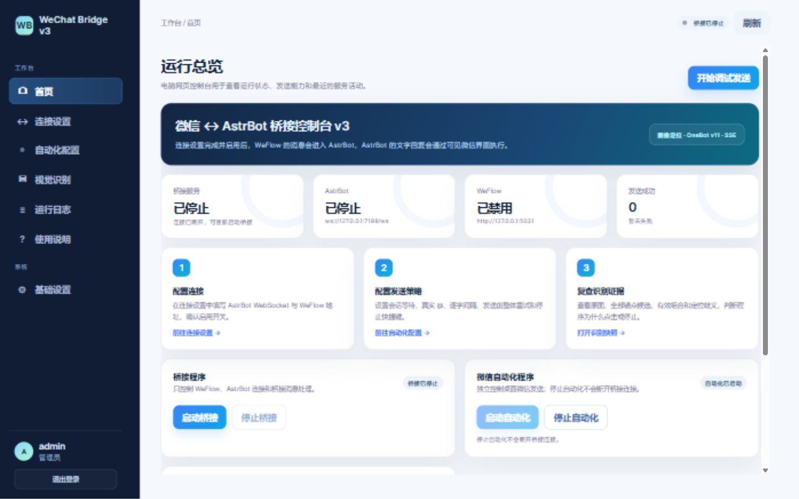
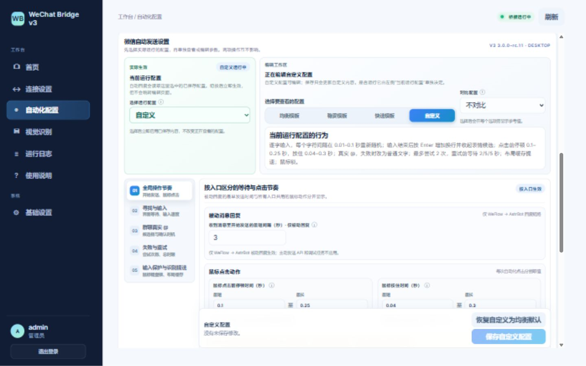
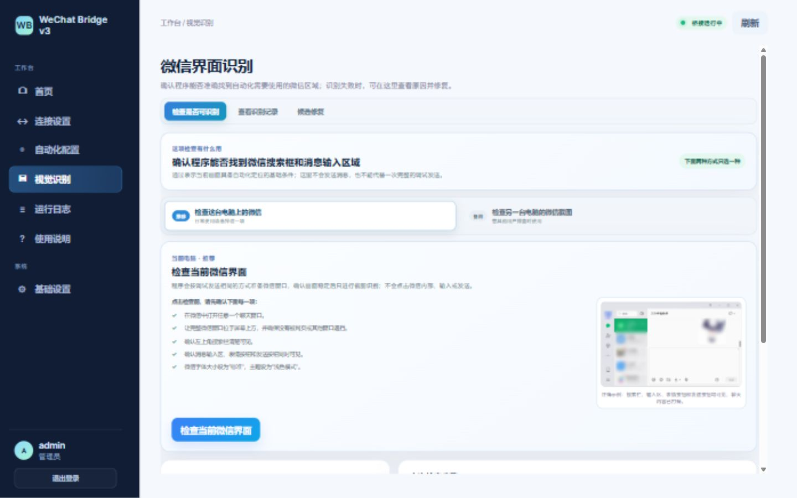
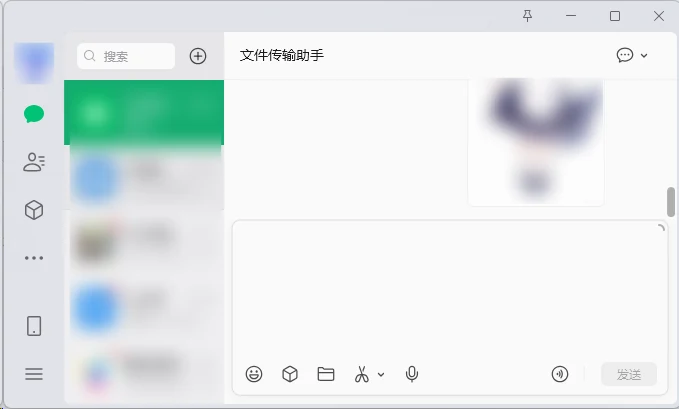

# WeChat Bridge v3

一个面向 Windows 电脑端微信的可见桌面自动化桥接程序。它可以接收 WeFlow 主动推送的消息，
通过 OneBot v11 交给 AstrBot 处理，再使用屏幕截图、图像定位、普通鼠标键盘和 Windows
剪贴板把文字、图片、文件及群聊 `@` 发送到桌面微信。

> 当前版本：`3.0.0-rc.11`（发布候选版）
> 本项目不是微信官方产品，不使用微信私有协议，也不承诺规避平台风控。使用者应自行遵守相关服务条款，
> 并先在安全测试会话中完成现场验证。

## 一句话了解

WeChat Bridge v3 把 **WeFlow 收到的微信消息**交给 **AstrBot**，再通过用户看得见的
桌面操作把回复送回微信；也允许 Agent 直接调用异步 API 主动发送消息。桥接连接、主动发送 API
与微信自动化分层运行：主动 API 不要求启动 WeFlow/AstrBot 桥接，停止桥接也不会取消 API 队列；
停止自动化会取消桌面发送任务，但不会切断 WeFlow 或 AstrBot。

## 主要能力

- 电脑网页控制台，桥接服务和微信自动化可以分别启动、停止。
- WeFlow SSE → OneBot v11 → AstrBot → 微信的被动回复链路。
- 不依赖桥接启停的 Agent 主动发送 API，包含幂等 `request_id`、排队位置、阶段进度和日志。
- 文字、图片、文件和群聊真实 `@` 的可见桌面发送。
- 基于 OpenCV 的组合式图像定位、DPI 自动适配、窗口布局缓存和识别失败快照。
- 识别兼容性检查与候选修复：用户可查看整张微信截图、调整候选阈值并保存本机适配图片。
- 可选系统托盘唤醒、固定微信窗口位置/大小、鼠标锁定、键盘锁定和默认 `Esc` 停止快捷键。
- Python、pip、依赖导入和运行异常均会保留错误信息，不会直接闪退。

## 界面预览

### 1. 运行总览：先看清状态，再决定启停

首页把桥接程序与微信自动化程序拆成两套控制：前者负责 WeFlow、AstrBot 和消息转发，后者只负责
桌面微信操作。页面同时显示连接状态、发送统计和最近活动，不用从控制台日志里猜程序是否还在运行。

### 2. 自动化配置：模板、节奏与保护集中管理

均衡、稳妥、快速是只读模板，自定义是唯一可编辑配置；“当前运行配置”和“正在查看/编辑的配置”
彼此独立。鼠标移动、点击前停顿、按住时长、逐字输入、真实 `@`、整体重试、窗口布局缓存和输入锁
按语义分区，最短/最长值使用紧凑的范围输入，不把所有参数堆成一张长表。

### 3. 视觉识别：检查、快照和候选修复形成闭环

程序可以检查本机当前微信界面，也可以导入另一台电脑的截图。识别失败时保留原图、各锚点候选、
组合结果和错误原因；用户可调低候选阈值加载更多候选，从符合几何关系的组合中确认本机模板，
而不会覆盖项目自带模板。

## 功能说明

| 模块 | 能做什么 | 重要边界 |
| --- | --- | --- |
| 消息桥接 | 仅接收 WeFlow SSE 主动推送，转换为 OneBot v11 事件交给 AstrBot | 不轮询会话、不绕过 WeFlow 白名单补拉消息 |
| Agent 主动发送 | 通过 `/api/v1/messages` 异步提交文字、图片或文件；桥接未启动或已停止时仍可排队执行 | 使用独立 Token 和 `request_id` 幂等；必须启动微信自动化，但不套用被动回复的“收到消息后最短间隔” |
| 桌面发送 | 搜索会话、定位输入区、输入文字/真实 `@`、粘贴图片或文件、点击发送按钮 | 只在发送提交前整体重试；提交后即使未看到气泡也不自动重发 |
| 图像定位 | OpenCV 模板匹配后用两个或更多锚点做距离、尺寸、边缘和工具栏组合校验 | 单张图片最高分不能直接决定点击；多组目标冲突时拒绝点击 |
| DPI 与本机适配 | 优先使用 Windows 报告的微信窗口 DPI，失败后按可调范围与间隔补充扫描 | 目前只支持标准字体和浅色微信；深浅模板不能混用 |
| 运行保护 | `Esc` 停止、可选鼠标/键盘锁、任务栏最小化恢复、通知区域唤醒、固定窗口位置或大小 | 不注入微信进程；输入锁异常或超时会自动释放 |
| 诊断证据 | 每步时间戳日志、识别快照、候选裁图、组合图和隐私诊断包 | 完整微信截图只留在本机；默认导出不包含完整聊天原图 |

## 自动化边界

项目只使用截图、图像定位、普通鼠标点击、键盘输入和 Windows 剪贴板。它不使用：

- OCR；
- pywinauto 或微信内部 UIA 元素操作；
- 微信进程注入、进程 Hook 或内存读写；
- 微信私有协议或微信数据库。

任务栏最小化的微信会先凭已有主窗口句柄直接恢复。只有找不到可恢复主窗口时，可选的托盘唤醒
才会读取 Windows 通知区域按钮的名称与矩形，再用普通鼠标单击唯一微信图标；不会读取或操作
微信内部元素，也不会要求用户先把仍在任务栏中的微信改为缩到托盘。

## 系统要求

- Windows 10/11 x64；
- Windows 电脑端微信；
- 64 位 Python 3.10–3.14；
- 微信字体大小设为“标准”；
- 微信主题设为“浅色模式”；
- 微信“发送消息”快捷键设为 `Ctrl+Enter`。

## 下载

[GitHub Releases](https://github.com/misaka16180/wechat-bridge-v3/releases) 是主发布渠道，提供版本说明、
三个 ZIP 和 SHA-256；夸克网盘是国内镜像与备用下载渠道。

| 下载内容 | GitHub | 夸克网盘镜像 | 适合用户 |
| --- | --- | --- | --- |
| 源码包 | [Releases](https://github.com/misaka16180/wechat-bridge-v3/releases) | [打开网盘](https://pan.quark.cn/s/ab90b8029f4b)，提取码 `CtvM` | 可以联网安装依赖，或准备另行下载环境包 |
| 仅环境包 | [Releases](https://github.com/misaka16180/wechat-bridge-v3/releases) | [打开网盘](https://pan.quark.cn/s/786afbc34739)，提取码 `5HSf` | 已有同版本源码，但安装 Python 依赖较慢 |
| 整合包 | [Releases](https://github.com/misaka16180/wechat-bridge-v3/releases) | [打开网盘](https://pan.quark.cn/s/fdafe9b0af54)，提取码 `G666` | 希望一次下载源码与完整依赖 |

依赖包和整合版不包含 Python 解释器。使用网盘镜像时，仍请对照对应 GitHub Release 公布的文件名、
大小和 SHA-256；校验不一致的压缩包不要运行。

## 快速开始

1. 下载源码版或整合版并解压到新的空文件夹。
2. 双击 `first.bat` 打开运行环境配置向导。
3. 明确选中已有 Python，或确认创建独立环境；向导不会在未确认时运行 pip。
4. 配置完成后双击 `start.bat`。
5. 使用控制台显示的临时账号和密码登录网页，并立即设置正式密码。
6. 完成微信的标准字体、浅色模式和 `Ctrl+Enter` 设置。
7. 先在网页“微信界面识别”中检查当前微信界面，再向安全测试会话调试发送。

更完整的安装、DPI、配置、重试和故障排查说明见[《使用说明》](使用说明.md)。

## 文档

- [使用说明](使用说明.md)
- [离线依赖与整合版说明](离线依赖与整合版说明.md)
- [主动发送 API](主动发送API.md)
- [现场验收清单](现场验收清单.md)
- [第三方依赖与许可证](THIRD_PARTY_NOTICES.md)

## 当前限制

- 只支持 Windows 电脑端微信、浅色模式和标准字体。
- 不通过文字识别消歧同名会话或同名群成员，默认选择列表中的第一项。
- 微信界面或大版本发生变化时，可能需要重新检查或补充定位模板。
- 发送按钮动作提交后返回 `sent_unverified` 或 `media_sent_unverified`，表示程序没有把聊天气泡当作最终送达证明；不会因此自动重发。
- 当前自动化程序已经过本机现场测试；WeFlow → AstrBot → 微信完整外部链路仍需由使用者在自己的环境中验收。

## 安全提示

- 控制台默认只监听 `127.0.0.1`。开放到局域网前应配置 Token、可信网络和 TLS。
- 不要提交或分享本机生成的 `bridge_config.json`、`bridge_state.json`、识别快照、日志或媒体临时目录。
- 随机等待只用于给界面留出响应时间和改善操作节奏，不保证降低账号风控。
- 一旦发送动作已经提交，调用方不要因为“未验证”状态再次创建新的发送请求。

## 许可证

项目本身使用 [MIT License](LICENSE)。第三方 Python 包遵循各自的上游许可证，详见
[THIRD_PARTY_NOTICES.md](THIRD_PARTY_NOTICES.md)。
