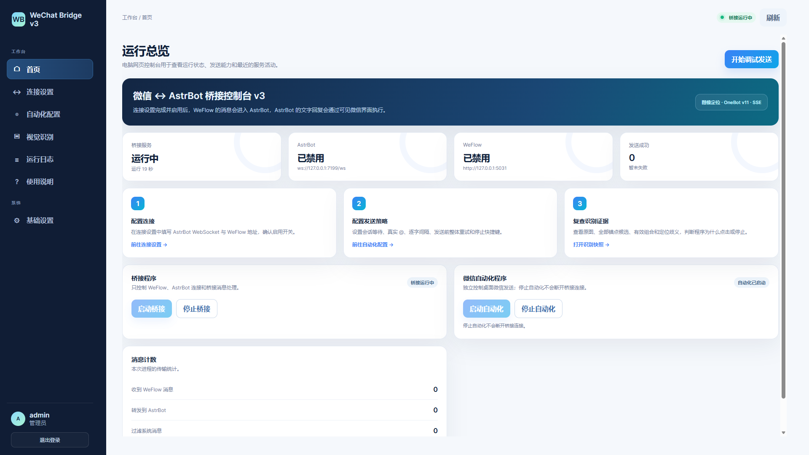
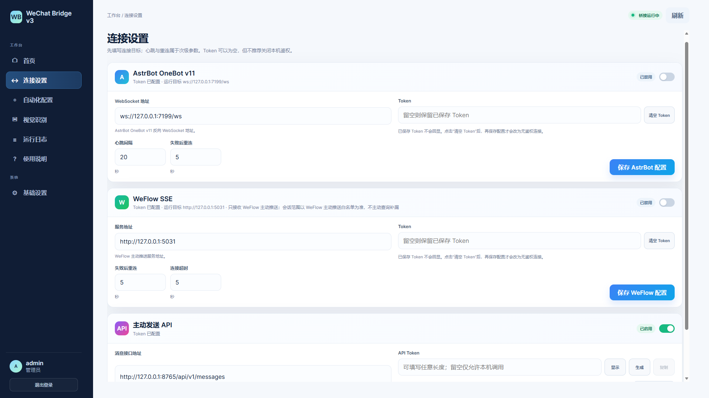
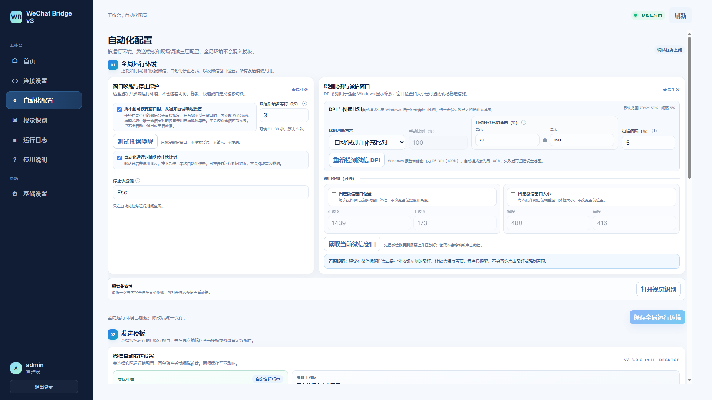
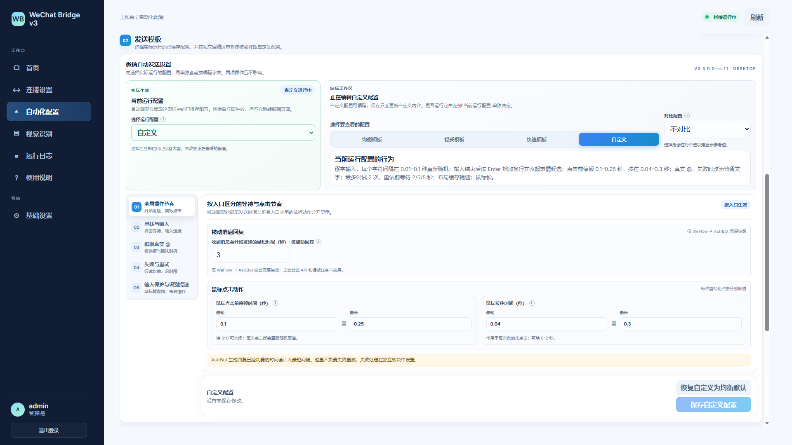
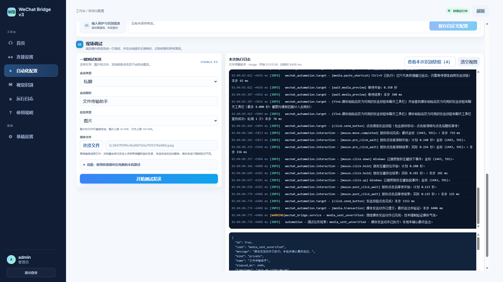
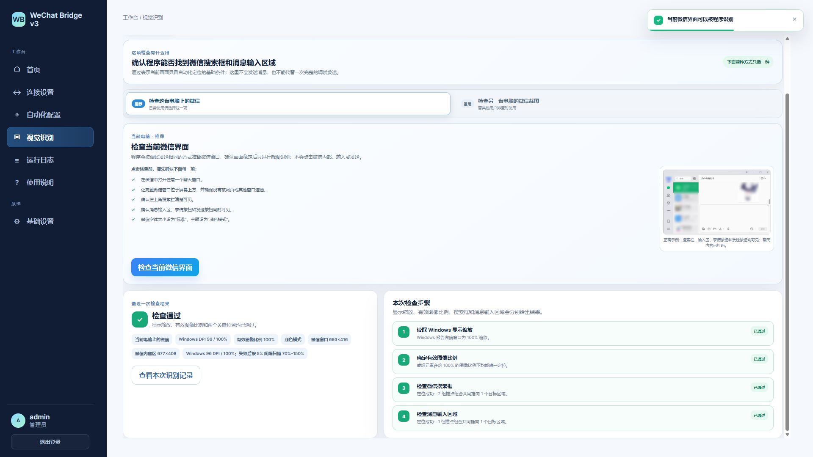
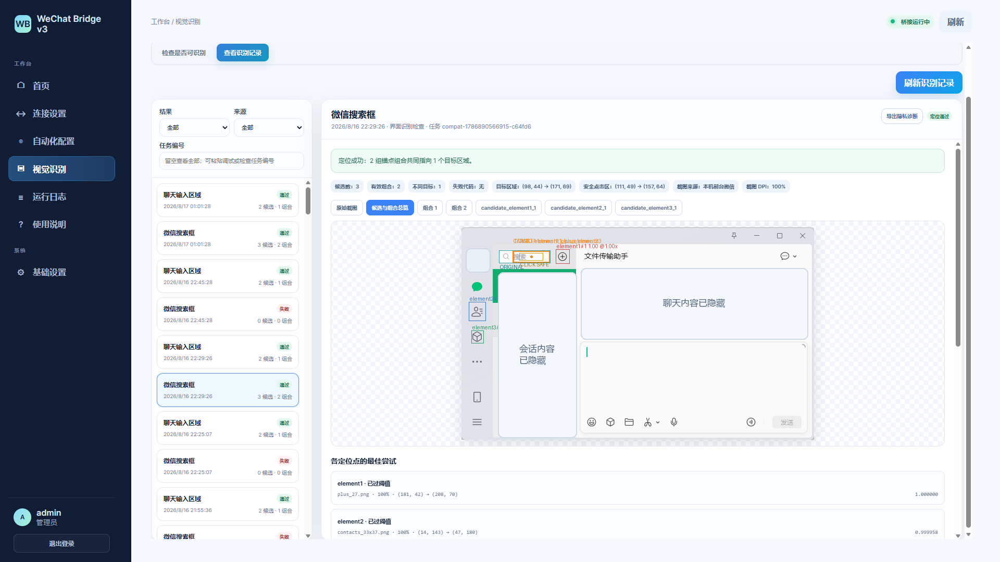
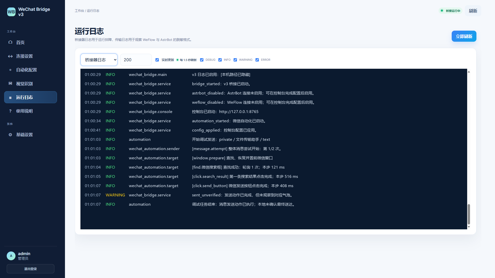
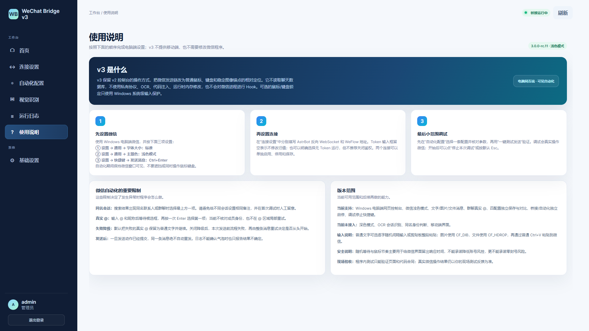
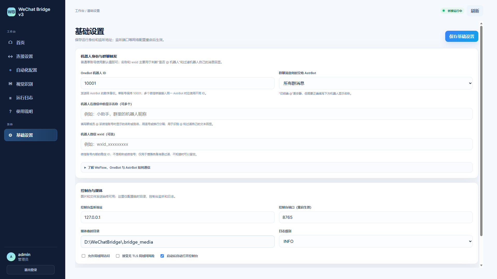

# 界面与操作图集

这里按实际使用顺序展示 WeChat Bridge v3.0.0-rc.11 的电脑网页端控制台。部分长页面分成不同滚动位置截图，合起来覆盖首页、连接、自动化、视觉识别、日志、说明和基础设置。

> 公开截图中的本机路径、微信联系人和聊天内容已经替换或隐藏；Token 未以明文展示。隐私处理只作用于文档副本，不会改变程序界面或用户原图。

## 推荐查看顺序

| 顺序 | 页面 | 主要解决的问题 |
| --- | --- | --- |
| 1 | 运行总览 | 桥接和自动化现在是否运行，最近有没有发送活动 |
| 2 | 连接设置 | AstrBot、WeFlow 和主动发送 API 分别如何连接 |
| 3–5 | 自动化配置 | 微信运行环境、发送策略和现场调试如何设置 |
| 6–7 | 视觉识别 | 当前界面能否识别，失败后怎样查看候选并修复 |
| 8 | 运行日志 | 连接、自动化与错误发生在什么时间、哪一步 |
| 9 | 使用说明 | 第一次使用前必须完成哪些微信设置 |
| 10 | 基础设置 | 机器人身份、群聊触发、控制台和媒体目录怎样配置 |

## 1. 运行总览

首页优先回答“现在到底开了什么”。桥接程序负责 WeFlow、AstrBot 与消息转发，微信自动化程序负责可见桌面操作，两者可以分别启动或停止。顶部状态卡、消息统计和最近活动用于快速判断当前运行情况。

## 2. 连接设置

AstrBot OneBot v11、WeFlow SSE 和主动发送 API 分成独立板块，各自保存、启停和重新连接。主动发送 API 不依赖桥接开关；只使用 Agent 主动发消息时，可以不开 AstrBot 和 WeFlow。已保存 Token 不会回显，页面只在当前未刷新会话中保留新输入值。

## 3. 自动化配置：全局运行环境

这一层设置所有发送方式共用的桌面环境，包括任务栏恢复与可选托盘唤醒、停止快捷键、DPI 自动识别与补充扫描、固定微信窗口位置或大小。DPI 扫描范围和间隔可以调整；窗口位置与大小也可以分别启用。

## 4. 自动化配置：发送模板

“当前运行配置”和“正在查看或编辑的配置”彼此独立：切换查看模板不会悄悄改变运行参数。均衡、稳妥、快速是只读模板，自定义是唯一可保存的编辑区；也可以选择另一套配置，在每项参数旁查看差异。

等待、鼠标移动、点击前停顿、按住时长、输入方式、真实 `@`、失败降级和整体重试均按语义分区。被动消息独有的“收到消息至开始发送的最短间隔”不会套用到主动 API 或现场调试。

## 5. 自动化配置：现场调试

现场调试支持私聊或群聊，以及文字、图片和文件。右侧逐步记录查找、等待、移动、点击、粘贴和发送动作的时间戳与耗时；失败时可以直接打开本次识别快照。发送动作已经提交但没有把气泡当作最终送达证明时，结果会明确显示 `sent_unverified` 或 `media_sent_unverified`，不会因此自动重发。

## 6. 视觉识别：兼容性检查

日常检查当前电脑时，只需选择“检查这台电脑上的微信”；只有替另一台电脑排查时才导入对方截图，两种方式任选一种。检查会先读取 Windows 显示缩放和微信窗口 DPI，再确定有效图像比例，最后分别验证搜索框与消息输入区域。

检查前应在微信中打开任意聊天窗口，确保窗口位于前台、无遮挡，搜索栏、消息输入区、表情按钮和发送按钮同时可见。程序只检查和截图，不会在此步骤输入或发送消息。

## 7. 视觉识别：识别记录与候选修复

识别记录保留整张微信截图、每个锚点的候选、符合几何要求的组合和最终目标区域。用户可以调低候选阈值加载更多候选，再从组合中确认正确图片作为本机适配模板；保存时新建本机模板，不覆盖项目自带模板。若有多个组合同时满足要求，记录会把它们分别列出，而不是选择单张图片最高分后盲目点击。

## 8. 运行日志

日志页可以切换桥接日志与自动化日志，设置显示条数、实时刷新并按级别筛选。自动化日志会写明每项查找、等待、点击和输入的时间戳，便于区分“界面仍在响应”与“程序已经卡住”。图中日志内容经过公开化处理，本机路径已隐藏。

## 9. 使用说明

内置说明先强调三项微信设置：字体大小为“标准”、主题为“浅色模式”、发送消息快捷键为 `Ctrl+Enter`。随后说明连接步骤、小范围调试、同名会话、真实 `@` 降级、发送后不盲目重试，以及当前不支持深色模式、OCR 和移动端界面等边界。

## 10. 基础设置

基础设置包含 OneBot 机器人 ID、机器人在微信中的显示名称或 wxid、群聊消息交给 AstrBot 的条件，以及控制台监听地址、端口、媒体临时目录和日志级别。监听端口等网络配置会在重启后生效；公开截图中的媒体目录已替换为示例路径。

## 接下来阅读

- [返回项目首页](../README.md)
- [完整使用说明](../使用说明.md)
- [主动发送 API](../主动发送API.md)
- [现场验收清单](../现场验收清单.md)
